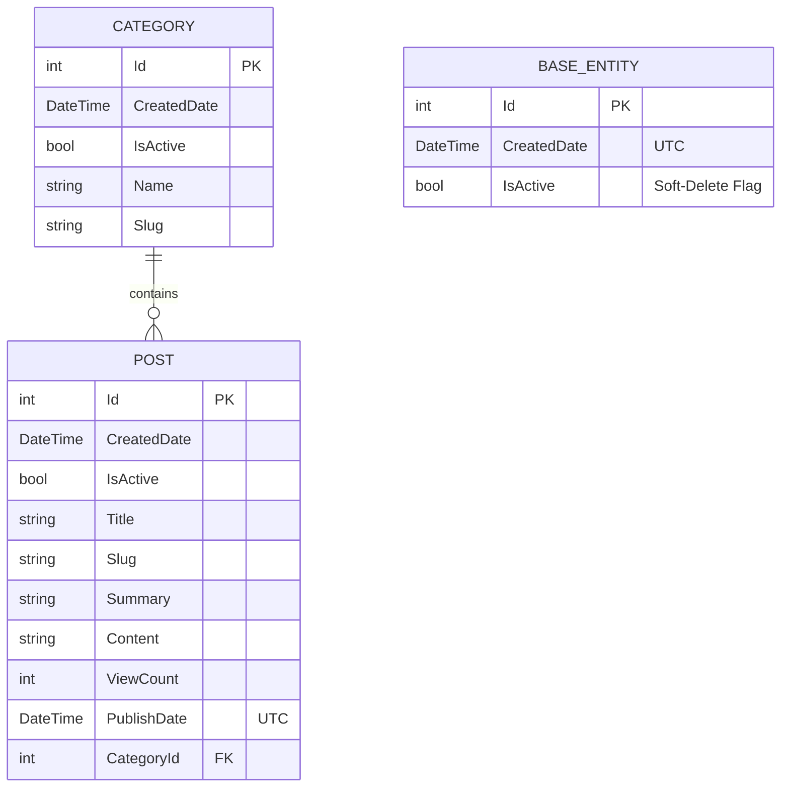

# 🚀 DevCoreBlog

A high-performance, developer-centric, server-side rendered blog platform built with **ASP.NET Core MVC (.NET 10)**, **Entity Framework Core 10**, and **PostgreSQL**. Designed with a **Tech Minimal & Modern Terminal** aesthetic for readers and a **Notion-inspired distraction-free** writing environment for administrators.

---

[-512BD4?style=flat&logo=dotnet)](https://dotnet.microsoft.com/)
[](https://docs.microsoft.com/en-us/dotnet/csharp/)
[](https://www.postgresql.org/)
[](https://docs.microsoft.com/en-us/ef/core/)
[](https://tailwindcss.com/)
[](LICENSE)

---

## 📑 Table of Contents

- [Overview](#-overview)
- [Key Features](#-key-features)
  - [Public Visitor Experience](#public-visitor-experience)
  - [Admin Experience & Content Management](#admin-experience--content-management)
- [Architecture & Design Principles](#-architecture--design-principles)
- [Project Directory Structure](#-project-directory-structure)
- [Tech Stack & Dependencies](#-tech-stack--dependencies)
- [Getting Started](#-getting-started)
  - [Prerequisites](#prerequisites)
  - [Installation & Setup](#installation--setup)
  - [Database Migrations](#database-migrations)
  - [Running the Application](#running-the-application)
- [Environment Configuration](#-environment-configuration)
- [URL Routing & Endpoints](#-url-routing--endpoints)
- [Interactive Terminal & Keyboard Shortcuts](#-interactive-terminal--keyboard-shortcuts)
- [Database Schema & Data Model](#-database-schema--data-model)
- [Coding Standards & Rules](#-coding-standards--rules)
- [License](#-license)

---

## 🌟 Overview

**DevCoreBlog** is a monolithic, server-side rendered (SSR) blog engine engineered specifically for technical writers, software engineers, and developer communities. It deliberately avoids bloated Single-Page Application (SPA) architectures and heavy client-side JavaScript frameworks in favor of lightning-fast server responses, clean semantic HTML, pure CSS terminal theming, and an intuitive N-Tier architectural pattern.

### Why DevCoreBlog?

- **Zero Client-Side Bloat:** Pure ASP.NET Core Razor Views rendered on the server with minimal, zero-dependency vanilla JavaScript.
- **Tech Minimal Design:** Sharp edges, high contrast, dark-first GitHub/terminal-inspired palette, monospaced accents, and zero excessive shadows or glassmorphism.
- **Interactive CLI & Command Palette:** Control the entire blog via an interactive terminal input bar (`devcore:~$`) or a Raycast/Cursor-like Command Palette (`/` or `Ctrl+K`).
- **Junior-Friendly Codebase:** Extensively documented with explanatory comments on every class, method, and architectural boundary.

---

## ✨ Key Features

### Public Visitor Experience

- **Bento Grid & Terminal Header:**
  - Dynamic breadcrumb prompt indicating the current path (e.g., `devcore@system: ~/posts/asp-net-core-guide $`).
  - Modular Bento Grid layout separating quick actions, search, categories, and external developer links.
- **Interactive Terminal Input Bar (`terminal.js`):**
  - Fully functional terminal prompt at the bottom of the page.
  - Supports commands: `help`, `ls` (lists categories via dynamic API), `cd <slug>`, `cd ..`, `clear`, and `home`.
  - Command history navigation with `↑` and `↓` arrow keys persisted across page loads via `sessionStorage`.
- **Command Palette Modal (`command-palette.js`):**
  - Activated anytime with `/`, `Ctrl+K`, or `⌘K`.
  - Fast keyboard-driven navigation (`/home`, `/ls`, `/newest`, `/grep <term>`, `/focus`, `/dark`, `/light`, `/whoami`).
  - Built-in **Focus Mode** (`/focus`) to collapse the sidebar for distraction-free reading.
- **Rich Technical Content Rendering:**
  - **Markdig** Markdown engine with GitHub Flavored Markdown (GFM) extensions (tables, task lists, strikethrough, auto-links).
  - **Prism.js** (Tomorrow Night theme) syntax highlighting with language label badges for all major programming languages.
  - Automatic reading time calculation (words-per-minute formula).
  - Live view counter incrementing on each post visit.
  - Related posts recommendation widget within the same category.
- **Search & Filter:**
  - Search posts by title or content with relevance-based ranking.
  - Filter posts by category with SEO-friendly slugs (`/kategori/{slug}`).
  - Dynamic pagination on listing and category pages.
- **Dynamic SEO & Social Sharing:**
  - Open Graph (OG) and Twitter Card meta tags tailored for social previews.
  - Auto-generated standard XML Sitemap at `/sitemap.xml` listing the home page, all categories, and published posts with change frequencies.
- **Dark / Light Theme Toggle:**
  - Instant theme switching with zero flash of unstyled content (FOUC) using localStorage.
- **Performance Optimization:**
  - ASP.NET Core Output Caching (`[OutputCache(Duration = 60)]`) for blazing-fast page delivery.

---

### Admin Experience & Content Management

- **Notion-Inspired Split Writing Canvas:**
  - 3fr writing area + 1fr right sidebar configuration panel.
  - **Toast UI Editor** integration in light mode with borderless minimalist styling.
  - Seamless, large, auto-expanding title input.
- **Dual Mode Editing & Media Support:**
  - Switch smoothly between Markdown source and WYSIWYG modes.
  - Drag-and-drop & paste image uploads via `imageBlobHook` directly saved to `/wwwroot/uploads` with GUID-based collision prevention.
- **Publishing Workflow:**
  - **Scheduled Publishing:** Set a future `PublishDate` in local time (automatically converted to UTC on save); scheduled posts remain hidden until their release timestamp.
  - **Soft Delete & Visibility Control:** Toggle `IsActive` status to draft or archive posts instantly.
- **Automated Slug Generation:**
  - `SlugGenerator` converts titles and category names into clean, URL-safe slugs with full Turkish character transliteration (`ç→c`, `ğ→g`, `ı→i`, `ö→o`, `ş→s`, `ü→u`).
  - Slugs are automatically regenerated when titles or names are edited.
- **Category Management with Cascade Protection:**
  - Full CRUD for categories with real-time post counts.
  - Safe deletion safeguards: Prevents deleting categories that contain existing blog posts to avoid orphaned content.
- **Admin Dashboard:**
  - Overview metrics: Total categories, total posts, aggregate view count across all articles, and quick-access table of recent posts.
- **Authentication & Security:**
  - Cookie Authentication (`Microsoft.AspNetCore.Authentication.Cookies`) without the heavy overhead of ASP.NET Core Identity.
  - Credentials stored securely in `.env` environment variables.
  - CSRF protection via `[ValidateAntiForgeryToken]` across all POST actions.

---

## 🏛 Architecture & Design Principles

DevCoreBlog follows an **N-Tier Architecture within a Single Project**, maintaining strict separation of concerns while eliminating over-engineering:

```
┌─────────────────────────────────────────────────────────┐
│                    Controllers Layer                    │
│   (Handles HTTP Requests, Route Binding, View Results)  │
└────────────────────────────┬────────────────────────────┘
                             │
                             ▼
┌─────────────────────────────────────────────────────────┐
│                     Services Layer                      │
│   (Business Rules, Slug Generation, Date Normalization) │
└────────────────────────────┬────────────────────────────┘
                             │
                             ▼
┌─────────────────────────────────────────────────────────┐
│                   Repositories Layer                    │
│      (Data Access, Custom Queries, EF Core Operations)  │
└────────────────────────────┬────────────────────────────┘
                             │
                             ▼
┌─────────────────────────────────────────────────────────┐
│                    Data & Core Layer                    │
│       (ApplicationDbContext, PostgreSQL, Entities)      │
└─────────────────────────────────────────────────────────┘
```

### Architectural Rules

1. **No DTOs / No AutoMapper:** Domain Entities (`Post`, `Category`) are passed directly from services to controllers to keep the codebase simple and transparent.
2. **No SPAs / No Web APIs:** All views are server-rendered Razor templates.
3. **No ASP.NET Identity:** Lightweight Cookie Authentication handles administrative access without creating unnecessary Identity tables.
4. **Repository Pattern:** Generic repository (`GenericRepository<T>`) handles common CRUD, while specialized repositories (`PostRepository`, `CategoryRepository`) encapsulate domain-specific queries with eager loading (`Include`).
5. **UTC Standard:** All timestamps stored in the database use `DateTime.UtcNow` (compatible with PostgreSQL `timestamp with time zone`).

---

## 📂 Project Directory Structure

```
DevCoreBlog/
├── .agents/                      # AI Agent behavioral rules & guidelines
│   └── AGENTS.md
├── Controllers/                  # MVC Controllers (HTTP handlers)
│   ├── AccountController.cs      # Admin authentication (Login / Logout)
│   ├── AdminCategoryController.cs# Admin category CRUD
│   ├── AdminController.cs        # Admin dashboard
│   ├── AdminPostController.cs    # Admin blog post CRUD & image uploads
│   ├── HomeController.cs         # Public-facing views (Home, Detail, Category, Search)
│   └── SeoController.cs          # Dynamic sitemap.xml generator
├── Core/                         # Core domain models and abstractions
│   ├── Entities/
│   │   ├── BaseEntity.cs         # Base class with Id, CreatedDate, IsActive
│   │   ├── Category.cs           # Category entity model
│   │   └── Post.cs               # Blog Post entity model (ViewCount, PublishDate, etc.)
│   └── Interfaces/
│       └── IRepository.cs        # Generic repository interface
├── Data/                         # EF Core Database Context
│   └── ApplicationDbContext.cs   # Entity mappings & DbSet definitions
├── Migrations/                   # EF Core PostgreSQL database migrations
├── Models/                       # View models (ErrorViewModel, etc.)
├── Repositories/                 # Data access layer implementations
│   ├── GenericRepository.cs      # Base EF Core CRUD operations
│   ├── PostRepository.cs         # Custom Post queries (Paged, Slug, Search, Related)
│   └── CategoryRepository.cs     # Custom Category queries (Cascade check, Post counts)
├── Services/                     # Business logic layer
│   ├── Interfaces/
│   │   ├── ICategoryService.cs   # Category business contracts
│   │   └── IPostService.cs       # Post business contracts
│   ├── CategoryService.cs        # Category business logic & validations
│   └── PostService.cs           # Post business logic, slug generation & view counter
├── Shared/                       # Shared utility helpers
│   └── Helpers/
│       ├── MarkdownHelper.cs     # Markdig pipeline wrapper (Markdown -> HTML)
│       └── SlugGenerator.cs      # Turkish character & URL slug converter
├── Views/                        # Razor view templates
│   ├── Account/                  # Login view
│   ├── Admin/                    # Admin Dashboard view
│   ├── AdminCategory/            # Category list, create, and edit forms
│   ├── AdminPost/                # Post list, Notion-style create and edit forms
│   ├── Home/                     # Public Index, Detail, Category, and Search views
│   └── Shared/                   # Layouts (_Layout.cshtml, _AdminLayout.cshtml, etc.)
├── wwwroot/                      # Static web assets
│   ├── css/
│   │   ├── site.css              # Custom styling & Prism overrides
│   │   └── terminal-theme.css    # Terminal Bento Grid layout & CSS variables
│   ├── js/
│   │   ├── command-palette.js    # Modal Command Palette logic
│   │   ├── terminal.js           # Interactive CLI bar parser
│   │   └── site.js
│   └── uploads/                  # Uploaded post images
├── .env.example                  # Environment variable configuration template
├── appsettings.json              # ASP.NET Core application settings
├── DevCoreBlog.csproj            # .NET 10 project file with package dependencies
└── Program.cs                    # Application startup, DI registration, & middleware
```

---

## 🛠 Tech Stack & Dependencies

| Layer / Area | Technology | Purpose |
| :--- | :--- | :--- |
| **Runtime** | .NET 10.0 (`net10.0`) | Web Application Framework |
| **Language** | C# 14 | Programming Language |
| **Web Framework** | ASP.NET Core MVC | Server-Side Rendering & MVC Routing |
| **Database** | PostgreSQL | Relational Database |
| **ORM** | Entity Framework Core 10 (`Npgsql`) | Object-Relational Mapping & Migrations |
| **Environment** | DotNetEnv 3.2.0 | `.env` configuration loader |
| **Markdown** | Markdig 1.3.2 | Advanced CommonMark & GFM Parser |
| **Syntax Highlight** | Prism.js 1.30.0 | Monospaced code highlighting (Tomorrow Night) |
| **Rich Text Editor** | Toast UI Editor | Notion-style Markdown/WYSIWYG Admin Editor |
| **Styling** | Tailwind CSS + Custom CSS | Tech Minimal responsive terminal design |
| **Authentication** | Cookie Authentication | Lightweight session security |

---

## 🚀 Getting Started

### Prerequisites

Ensure you have the following installed on your machine:
- [.NET 10.0 SDK](https://dotnet.microsoft.com/download/dotnet/10.0)
- [PostgreSQL 14+](https://www.postgresql.org/download/) (running locally or via Docker)
- [Git](https://git-scm.com/)

---

### Installation & Setup

1. **Clone the repository:**
   ```bash
   git clone https://github.com/your-username/DevCoreBlog.git
   cd DevCoreBlog
   ```

2. **Configure Environment Variables:**
   Copy `.env.example` to `.env` in the project root:
   ```bash
   cp .env.example .env
   ```

3. **Edit `.env` with your credentials:**
   ```env
   # PostgreSQL Connection String
   DB_CONNECTION_STRING=Host=localhost;Port=5432;Database=DevCoreBlogDb;Username=postgres;Password=your_password

   # Admin Panel Login Credentials
   ADMIN_USERNAME=admin
   ADMIN_PASSWORD=YourSecurePassword123!
   ```

---

### Database Migrations

Apply the Entity Framework Core migrations to create the database schema:

```bash
dotnet ef database update
```

*(If `dotnet-ef` is not installed globally, install it with: `dotnet tool install --global dotnet-ef`)*

---

### Running the Application

Start the development server:

```bash
dotnet run
```

Or run with hot-reload enabled:

```bash
dotnet watch
```

Once running, navigate to:
- **Public Blog:** `https://localhost:5001` or `http://localhost:5000`
- **Admin Panel:** `https://localhost:5001/Account/Login`

---

## ⚙️ Environment Configuration

DevCoreBlog utilizes `DotNetEnv` to manage sensitive configuration values outside of source control.

| Variable Name | Description | Example |
| :--- | :--- | :--- |
| `DB_CONNECTION_STRING` | PostgreSQL connection string | `Host=localhost;Port=5432;Database=DevCoreBlogDb;Username=postgres;Password=secret` |
| `ADMIN_USERNAME` | Administrator login username | `admin` |
| `ADMIN_PASSWORD` | Administrator login password | `SuperSecretPassword!2026` |

> [!IMPORTANT]
> Never commit your real `.env` file to version control. Ensure `.env` is listed in your `.gitignore`.

---

## 🗺 URL Routing & Endpoints

### Public Endpoints

| URL Pattern | Controller / Action | Description |
| :--- | :--- | :--- |
| `/` | `HomeController.Index` | Home page listing published posts (paged) |
| `/yazi/{slug}` | `HomeController.Detail` | Single post view (increments view count) |
| `/kategori/{slug}` | `HomeController.Category` | Posts filtered by category |
| `/ara?query={term}` | `HomeController.Search` | Search results for title & content |
| `/sitemap.xml` | `SeoController.Sitemap` | Dynamic XML Sitemap for search engines |
| `/api/categories` | `HomeController.ApiCategories` | Lightweight JSON endpoint for terminal `ls` |

### Administrative Endpoints (`[Authorize]`)

| URL Pattern | Controller / Action | Description |
| :--- | :--- | :--- |
| `/Account/Login` | `AccountController.Login` | Admin login page (GET / POST) |
| `/Account/Logout` | `AccountController.Logout` | Admin logout action (POST) |
| `/Admin/Dashboard` | `AdminController.Dashboard` | Dashboard with analytics & recent posts |
| `/AdminPost` | `AdminPostController.Index` | Post management table |
| `/AdminPost/Create` | `AdminPostController.Create` | Notion-style post creator |
| `/AdminPost/Edit/{id}` | `AdminPostController.Edit` | Post editor |
| `/AdminPost/Delete/{id}`| `AdminPostController.Delete` | Post deletion |
| `/AdminPost/UploadImage`| `AdminPostController.UploadImage` | Image upload endpoint for editor |
| `/AdminCategory` | `AdminCategoryController.Index` | Category management table |
| `/AdminCategory/Create` | `AdminCategoryController.Create` | New category form |
| `/AdminCategory/Edit/{id}`| `AdminCategoryController.Edit` | Category edit form |
| `/AdminCategory/Delete/{id}`|`AdminCategoryController.Delete` | Category deletion with cascade check |

---

## ⌨️ Interactive Terminal & Keyboard Shortcuts

### Bottom Terminal CLI (`devcore:~$`)

| Command | Action |
| :--- | :--- |
| `help` | Displays the interactive help table with all commands |
| `ls` | Fetches and lists all blog categories via `/api/categories` |
| `cd <slug>` | Navigates to the specified category page (e.g., `cd csharp`) |
| `cd ~` or `home` | Navigates back to the homepage |
| `cd ..` | Navigates back in browser history |
| `clear` | Clears terminal command output |
| `↑` / `↓` | Cycles through previous command history |

### Command Palette Modal

| Shortcut / Command | Description |
| :--- | :--- |
| `/` or `Ctrl+K` / `⌘K` | Opens the Command Palette from anywhere |
| `Escape` | Closes the Command Palette |
| `↑` / `↓` + `Enter` | Navigate and execute highlighted command |
| `/home` | Navigate to home page |
| `/ls` | View post grid |
| `/newest` | Read latest post |
| `/grep <keyword>` | Search blog posts |
| `/focus` | Toggle focus reading mode (hides/shows sidebar) |
| `/dark` | Switch to dark theme |
| `/light` | Switch to light theme |

---

## 🗄 Database Schema & Data Model



### Entity Highlights

- **`BaseEntity`:** Abstract base class providing common `Id`, `CreatedDate` (UTC), and `IsActive` (soft-delete flag).
- **`Category`:** Organizes blog posts with one-to-many relationship (`ICollection<Post>`).
- **`Post`:** Core content model including `ViewCount` for reader analytics and `PublishDate` for scheduled releases.

---

## 📐 Coding Standards & Rules

To maintain code clarity and project health, the codebase follows the rules defined in `.agents/AGENTS.md`:

1. **Conciseness & DRY:** No bloated code or over-engineering. Short, focused methods with straightforward LINQ queries.
2. **Junior-Friendly Comments:** All C# classes, interfaces, and complex algorithms feature English comments explaining *what* the code does and *why* it is structured that way.
3. **Tech Minimal UI:** Strict prohibition of excessive shadows (`shadow-2xl`), glassmorphism (`backdrop-blur`), neon gradients, or overly rounded corners (`rounded-3xl`).
4. **Direct Domain Entities:** Services directly return entities to controllers without unnecessary DTO conversion boilerplate.

---

## 📄 License

This project is licensed under the **MIT License** — see the [LICENSE](LICENSE) file for details.

---

<div align="center">
  <sub>Built with ❤️ using ASP.NET Core & PostgreSQL for developers who love clean code and minimalist interfaces.</sub>
</div>
